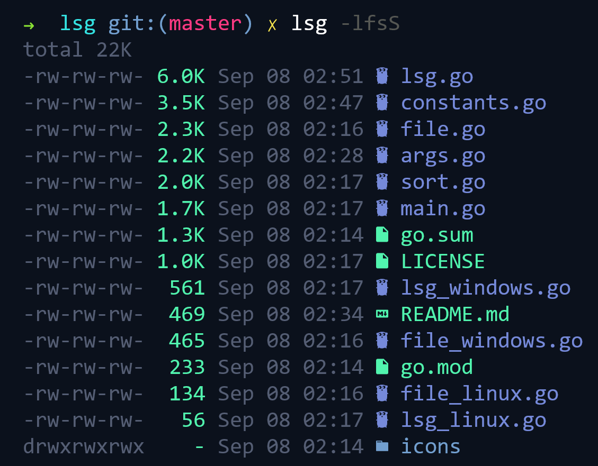

# lsg
`lsg` is a cross-platform implementation of `ls` written in Go

# Features
- Eye candy (Colors, [Nerd Font](https://github.com/ryanoasis/nerd-fonts) icons)
- Glob patterns (`*.go`, `**/*`, `**/*.png`)
- Tree output
- Execution speed is comparable to `ls`
- Supports Windows hidden files and junctions

# Install
With `go get`:

    go get github.com/operatios/lsg

Or download a binary from [releases page](https://github.com/operatios/lsg/releases)

# Usage
Examples:
- `lsg -alfb`
- `lsg dir1 dir2 --sort=extension`
- `lsg **/*.flac **/*.png`

Flags:

    -a, --all            do not ignore hidden files
    -l, --long-listing   use a long listing format
    -b, --bytes          with -l: print size in bytes
    -f, --filemode       with -l: print filemode
    -t, --tree           use a tree format
    -s, --sort string    sort by [size|s|time|t|extension|x|category|c]
    -r, --reverse        reverse file order
    -c, --columns int    set maximum amount of columns
        --col-sep int    set column separator length (default 2)
        --no-targets     disable link targets
        --no-colors      disable colors
        --no-icons       disable icons

# Customization
To edit the color scheme or replace/add icons, you need to have Go installed

- `git clone https://github.com/operatios/lsg.git`

- Edit [this](https://github.com/operatios/lsg/blob/c379eb3bacaa258623f81f5d79f5deba092fb3d0/icons/icons.go#L24) and [this](https://github.com/operatios/lsg/blob/c379eb3bacaa258623f81f5d79f5deba092fb3d0/constants.go#L18) to your liking
-  Run `go install` in edited directory

# More screenshots

# Special thanks to:
- [doublestar](https://github.com/bmatcuk/doublestar) - Powers globbing
- [aurora](https://github.com/logrusorgru/aurora) - Brings colors
- [pflag](https://github.com/spf13/pflag) - POSIX/GNU-style --flags
